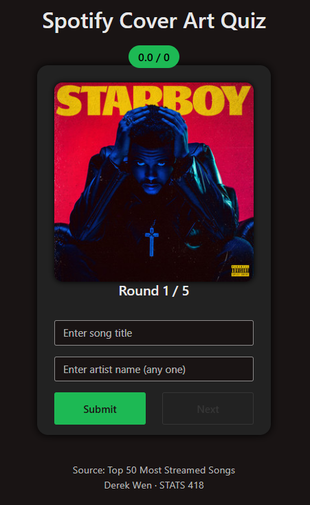

# Spotify Cover Art Quiz

### Final Project - UCLA STATS 418: Tools in Data Science (Spring 2025)

### Live Shiny App - [Spotify Cover Art Quiz](https://dwen.shinyapps.io/spotify-cover-art-quiz/)

## Background

The Spotify Cover Art Quiz is an interactive web-based application that quizzes users to identify song names and artist names in five rounds based solely on the Spotify cover artwork. The application leverages a recommendation model to suggest similar tracks if the user happens to enjoy the track. The songs are called from Spotify's Web API and are the top 50 most streamed songs on Spotify.

## Exploratory Data Analysis

Our dataset was created by fetching data from a Spotify playlist "Top 50 Most Streamed Songs" using Spotify's Web API.

[Spotify Playlist](https://open.spotify.com/playlist/7z4ebkPXukjtS08NxvoyoN?si=7876a0a8a6f44e60)

### Distribution of Artist Followers

This histogram shows the distribution of followers for the artists featured in the playlist.


### Distribution of Artist Country

This histogram shows the distribution of countries for the artists featured in the playlist.


### Distribution of Top Genres

This barplot shows the distribution of the top genres featured in the playlist.


### Feature Correlation Heatmap

The heatmap below illustrates correlations among numerical track metadata features, including popularity, duration, explicitness, and artist followers.


## Methodology

### Data Collection

Data was gathered using Spotify’s Web API with a Python script:

* Track metadata includes song name, artists, popularity, duration, explicitness, and cover art URL.
* Artist metadata includes genres, artist popularity, and followers.

### Recommendation Model

A recommendation system was developed using k-Nearest Neighbors (k-NN):

* All numerical features scaled using StandardScaler to ensure equal influence in distance calculations
* Each song is represented by a numeric feature vector
* k-NN identifies tracks similar to a user-selected song.
* Similarity measured using Euclidean distance after scaling

**Model Artifacts:**

* **`X_full.pkl`** - Dataset used for nearest neighbor searches.
* **`scaler.pkl`** - Fitted scaler object.
* **`nn_model.pkl`** - Trained k-NN model.

### Flask API Deployment

The recommendation model was served using a Flask API, deployed within a Docker container on Amazon EC2.

**Endpoint:**

```
GET /recommend/<track_id>?k=<num>
```

Returns a JSON response of recommended tracks.

### Shiny App Front-end

The interactive quiz UI was built using R Shiny:

* Users guess the song name and artist name from the displayed Spotify cover art.
* After each guess, the model provides similar song recommendations.
* Users can play up to five rounds in a session, with scores calculated based on how many they got corrected out of the total songs.

## Results

The deployed Shiny application allows users to play a quiz to test their music knowledge and memory.

**Example of Interactive Quiz:**



## Deployment

The application components are hosted separately:

* **Quiz UI (R Shiny):** [Spotify Cover Art Quiz](https://dwen.shinyapps.io/spotify-cover-art-quiz/)
* **Recommendation API:** Flask API running inside a Docker container on Amazon EC2 instance.

### Deploying the Shiny App:

```r
library(rsconnect)
rsconnect::deployApp("src/r_shiny_app", appName="spotify-cover-art-quiz")
```

### Running the Flask API (Docker on EC2):

```bash
cd ~/spotify-api
docker rm -f spotify-api 2>/dev/null
docker build -t spotify-api .
docker run -d --name spotify-api \
  --restart unless-stopped \
  -p 8000:8000 spotify-api
```

---

Derek Wen, UCLA MASDS