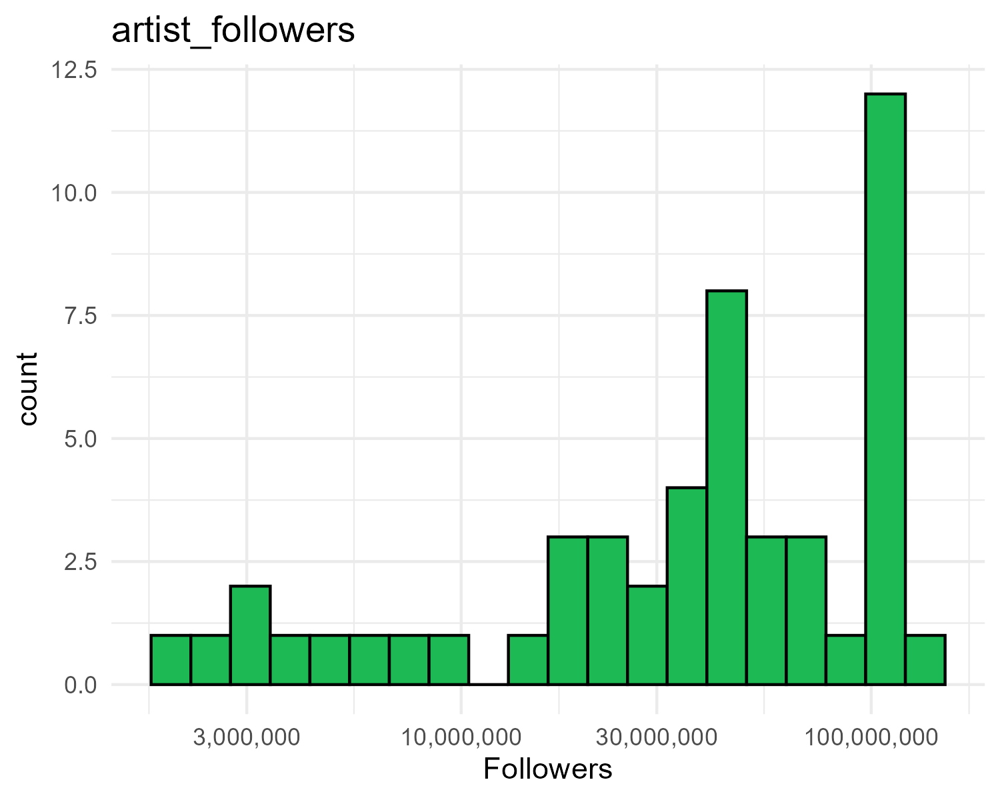
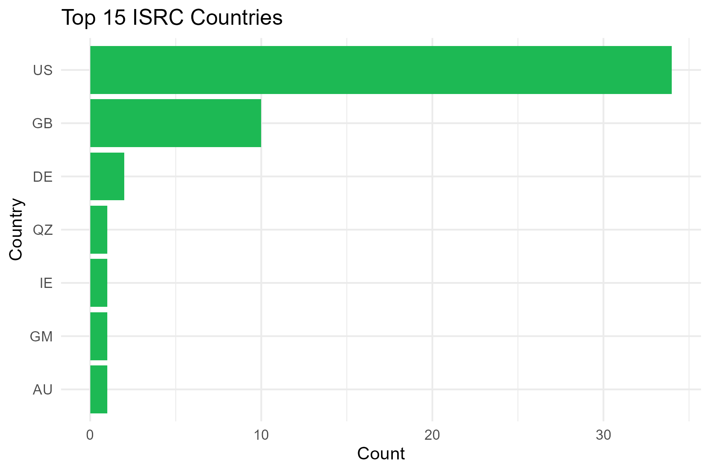
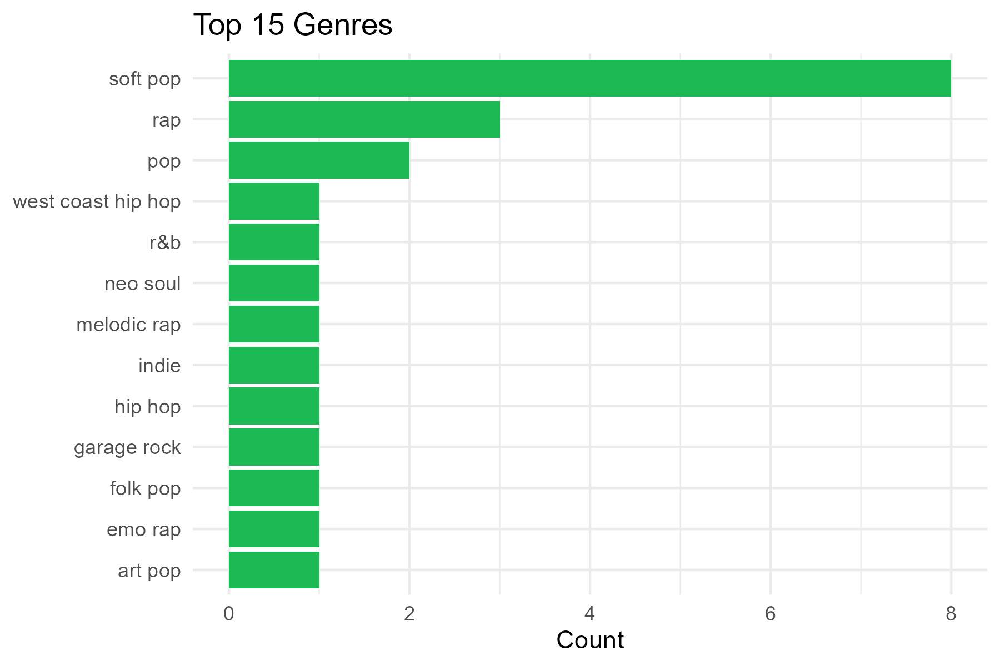
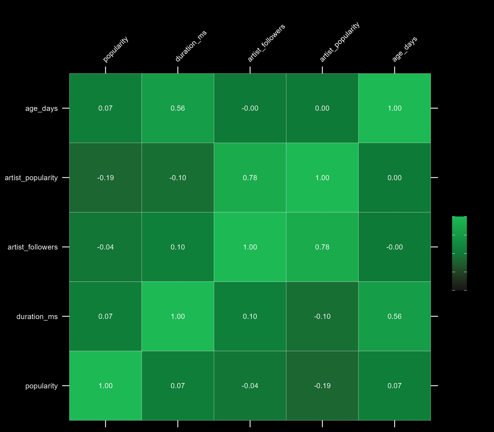
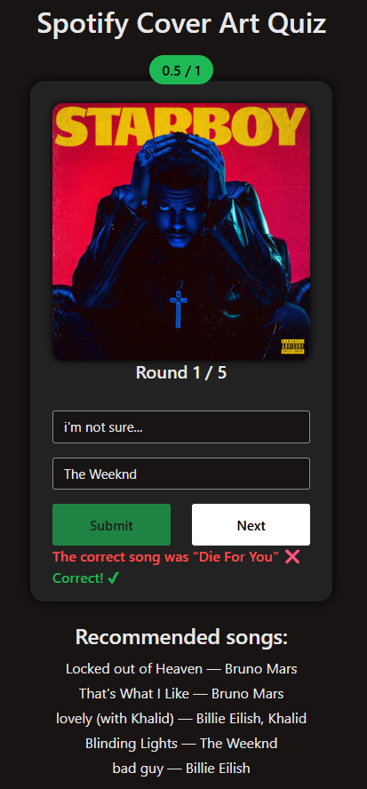

# Spotify Cover Art Quiz

### Final Project - UCLA STATS 418: Tools in Data Science (Spring 2025)

### Live Shiny App - [Spotify Cover Art Quiz](https://dwen.shinyapps.io/spotify-cover-art-quiz/)

## Background

The Spotify Cover Art Quiz is an interactive web-based application that quizzes users to identify song names and artist names in five rounds based solely on the Spotify cover artwork. The application leverages a recommendation model to suggest similar tracks if the user happens to enjoy the track. The songs are called from Spotify's Web API and are the top 50 most streamed songs on Spotify as of May 2025.

## Exploratory Data Analysis

### Distribution of Artist Followers

This histogram shows the distribution of followers for the artists featured in the playlist. The distribution is highly left-skewed, with most artists having a very large following and few artists having a relatively smaller following.



### Distribution of Artist Country

This histogram shows the distribution of countries for the artists featured in the playlist. Artists are majority in the US, followed by the UK, with other countries contributing only modestly.



### Distribution of Top Genres

This barplot shows the distribution of the top genres featured in the playlist. Soft pop is the most frequent genre, followed by rap and pop, with all other genres appearing only once.



### Feature Correlation Heatmap

The heatmap below illustrates correlations among numerical track metadata features, including popularity, duration, explicitness, and artist followers. Artist follower counts and artist popularity are strongly positively correlated, age (days since release) and track duration show a moderate positive relationship, and overall song popularity exhibits only very weak correlations with the other numeric features.



## Methodology

### Data Collection

The dataset was created by fetching data from the [Spotify playlist “Top 50 Most Streamed Songs”](https://open.spotify.com/playlist/7z4ebkPXukjtS08NxvoyoN?si=7876a0a8a6f44e60) using Spotify’s Web API, with data collection and storage handled by a Python script (`src/fetch_top50.py`), and contains the following metadata:

* Track metadata includes song name, artists, popularity, duration, explicitness, and cover art URL.
* Artist metadata includes genres, artist popularity, and followers.

### Recommendation Model

A recommendation system was developed using k-Nearest Neighbors (k-NN):

* All numerical features scaled using StandardScaler to ensure equal influence in distance calculations (one-hot encode for genre and countries)
* Each song is represented by a numeric feature vector
* k-NN identifies tracks similar to a user-selected song
* Similarity measured using Euclidean distance after scaling

K-NN was used due to the fact that it is lightweight, simple, interpretable, very fast, and requires no training labels.

| Numeric features |
|------------------|
| popularity (track) |
| duration_ms |
| explicit (0/1) |
| age_days (days since release) |
| artist_popularity |
| artist_followers (log-scaled only in the model) |
| n_artist_genres |

**Model Artifacts:**

* **`X_full.pkl`** - Dataset used for nearest neighbor searches
* **`scaler.pkl`** - Fitted scaler object
* **`nn_model.pkl`** - Trained k-NN model
* **`feature_order.json`** - Column order for future transforms

## Deployment

### Flask API Deployment

The recommendation model was served using a Flask API, deployed within a Docker container on Amazon EC2. CORS is enabled in `app.py` so the Shiny front-end can call it. The Dockerfile lives in the project root `spotify-api` on EC2 but is also mirrored in the GitHub directory `src/api`.

**Endpoint:**

```
GET /recommend/<track_id>?k=<num>
```

Returns a JSON response of recommended tracks.

### Running the Flask API (Docker on EC2):

The EC2 security group must allow inbound port 8000.

```bash
cd ~/spotify-api
docker rm -f spotify-api 2>/dev/null
docker build -t spotify-api .
docker run -d --name spotify-api \
  --restart unless-stopped \
  -p 8000:8000 spotify-api
```

### Shiny App Front-end

The interactive quiz UI was built using R Shiny and hosted on shinyapps.io

### Deploying the Shiny App:

```r
library(rsconnect)
rsconnect::deployApp("src/r_shiny_app", appName="spotify-cover-art-quiz")
```

## Results

The deployed Shiny application allows users to play a quiz to test their music knowledge and memory. The user has five rounds in a single session to guess the song name and artist name based on cover art. After answering, the application shows the answers and shows whether or not the user guessed the song and artist name correctly. The user is awarded 0.5 points for correctly guessing the song name or artist name. After each round, the quiz recommends similar songs based on the recommendation model

**Example of The Quiz:**



---

Derek Wen, UCLA MASDS